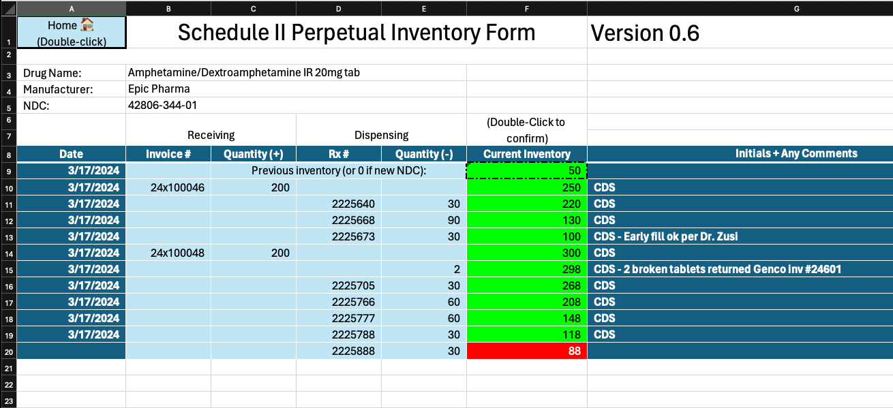

# C-II perpetual inventory
## An Excel Workbook powered by macros to track controlled substance inventory.

Replace paper logs and basic spreadsheets with a more powerful alternative. From the Home sheet, scan the barcode of a stock bottle and you're taken to the page for that drug. For an NDC[^1] that's not in the system, a new sheet is created based on a blank template.

Steps:
1. Scan stock bottle barcode (then press Enter if your scanner doesn't automatically)
2. Scan Rx # barcode (then press Enter if your scanner doesn't automatically)
3. Input quantity, press Enter
4. After verifying backcount, double-click the red total cell to confirm. It will turn green and record the date.
5. Double-click the Home button to start over.

Notes on macros: For security reasons, Excel puts up a few hurdles to running macros. You should only do the following for files you trust. After downloading, find the file on your computer, right-click, select "Properties", then check the "Unblock" box in the Properties dialog. 

Version 0.6 updates:
- Input validation: The stock bottle barcode scan input now only accepts a 14-character input. Warning, this may break the function if anyone out there besides me and my coworkers are wanting to use this. Our scanners append '^' to the beginning and end of all scans.)
- When arriving at a sheet in the workbook, the Rx# cell of the first blank line will be selected for an existing sheet. (Added in 0.3, but didn't work correctly)

Version 0.5 updates:
- I think this is the first version that I would call stable and minimally functional.
- Added barcode scanning in the Rx# field that should be compatible with the vial/label barcode from the implementation of McKesson Enterprise that we use.

Version 0.4 updates:
- Cleaned up formatting of template and example.
- Fixed some bugs causing unwanted behavior (color changes, date stamp) in the top few rows of the sheet.

Version 0.3 updates:
- Minimal instructions included on Home page.
- Template cleaned and updated.
- Home button in top left of drug record functions correctly on double-click
- Added logic to select "Previous inventory" cell on a blank sheet, or the next Rx# cell for dispensing on an existing sheet.

[^1]: UPC really, and I don't understand why they're different in a non-standard way ¯\\\_(ツ)\_/¯
